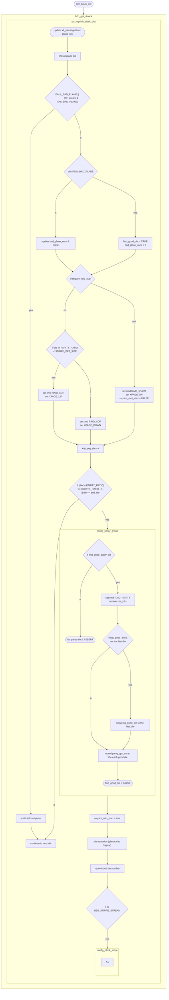

```mermaid
flowchart TD
    start([b2n_block_init]) --> b2n_get_sblock
    subgraph b2n_get_sblock
        subgraph pu_mgr.init_block_dist
            direction TB %%TB
            %% style pu_mgr.init_block_dist fill:#6964
            start_b(["update xlt_info & get bad plane info"]) --> a
            a[chk all plane die] --> b{"if ALL_BAD_PLANE || 
            (PF stream & HAS_BAD_PLANE)"}
            b --yes--> c[add total bad plane]
            b --no--> d{"chk if NO_BAD_PLANE"}
            c --> e[continue to next die]
            d --yes--> f["find_good_die = TRUE
            bad_plane_num = 0"]
            d --no---> g[update bad_plane_num & mask]
            g --> h{"if require_raid_start"}
            f --> h
            h --yes--> i["set cmd RAID_START 
            set XPAGE_UP
            require_raid_start = FALSE"]
            h --"no"---> j{"if die % PARITY_RATIO 
            < STRIPE_DFT_SIZE"}
            j --yes--> k["set cmd RAID_XOR
            set XPAGE_UP"]
            j --no--> l["set cmd RAID_XOR
            set XPAGE_DOWN"]
            k ---> m["xlat_seq_die ++"]
            l --> m
            i ---> m
            m --> n{"if (die % PARITY_RATIO) 
            == (PARITY_RATIO - 1)
            || die == end_die"}
            n --no---> e
            n --yes--> config_parity_group
                subgraph config_parity_group
                    direction TB
                    A{"if find_good_parity_die"} --yes--> B["set cmd RAID_PARITY
                    update xlat_info"]
                    A --no--> C(["No parity die & ASSERT"])
                    B --> D{"if log_good_die is 
                    not the last die"}
                    D --yes--> E["swap log_good_die to the last_die"]
                    D --no----> F["record parity_grp_cnt to the each good die"]
                    E --> F
                    F --> G(["find_good_die = FALSE"])
                end
            config_parity_group --> p["require_raid_start = true"]
            p --> q["die traslation (physical to logical)"]
            q --> r["record total die number"]
            r --> s{"if is B2N_STRIPE_STREAM"}
            s --yes--> config_block_stripe
                subgraph config_block_stripe
                    A1
                end

        end
    end
```