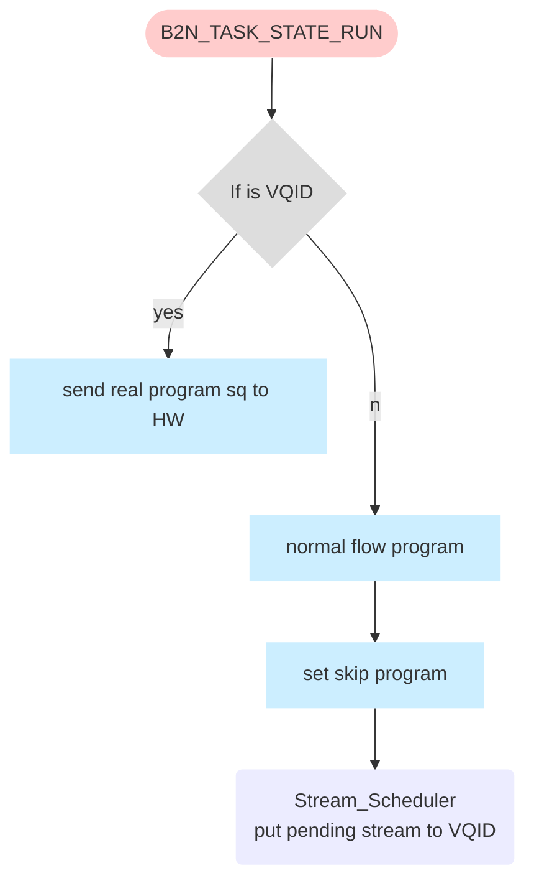

```mermaid
flowchart TD
a([B2N_TASK_STATE_RUN]) --> a1{"If is VQID"}
a1 --no--> a2["normal flow program"]
a2 --> a3["set skip program"]
a3 --> a4("Stream_Scheduler
put pending stream to VQID")
a1 --yes--> a5["send real program sq to HW"]

style a fill:#FFCCCC,stroke:#0000

style a1 fill:#DDDDDD,stroke:#0000
style a2 fill:#CCEEFF,stroke:#0000
style a3 fill:#CCEEFF,stroke:#0000
style a4 fill:#F,stroke:#0000
style a5 fill:#CCEEFF,stroke:#0000
```