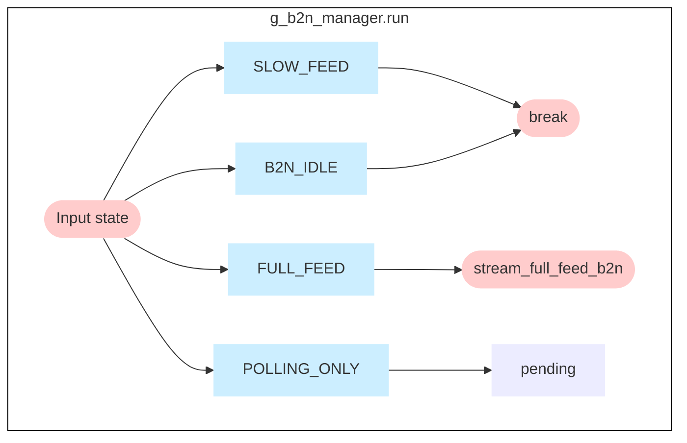

```mermaid
flowchart 
subgraph a["g_b2n_manager.run"]
    b(["Input state"]) --> c[FULL_FEED] 
    b --> d[POLLING_ONLY]
    b --> e[SLOW_FEED] --> i([break])
    b --> f[B2N_IDLE] --> i
    c --> g([stream_full_feed_b2n])
    d --> h[pending]
end

style a fill:#FFFFFF,stroke:#000000
style b fill:#FFCCCC,stroke:#0000
style c fill:#CCEEFF,stroke:#0000
style d fill:#CCEEFF,stroke:#0000
style e fill:#CCEEFF,stroke:#0000
style f fill:#CCEEFF,stroke:#0000
style g fill:#FFCCCC,stroke:#0000
style h fill:#F,stroke:#0000
style i fill:#FFCCCC,stroke:#0000

```