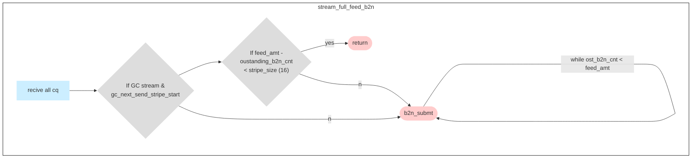

```mermaid
flowchart TD
subgraph stream_full_feed_b2n
    b1["recive all cq"] --> b2{"If GC stream & 
    gc_next_send_stripe_start"}
    b2 --> b3{"If feed_amt - 
    oustanding_b2n_cnt 
    < stripe_size (16)"}
    b3 --yes--> b4([return])
    b2 --no--> b5([b2n_submt])
    b5 --"while ost_b2n_cnt < feed_amt"----> b5
    b3 --no--> b5
end

style stream_full_feed_b2n fill:#FFFFFF,stroke:#000000
style b2 fill:#DDDDDD,stroke:#0000
style b1 fill:#CCEEFF,stroke:#0000
style b3 fill:#DDDDDD,stroke:#0000
style b4 fill:#FFCCCC,stroke:#0000
style b5 fill:#FFCCCC,stroke:#0000

```