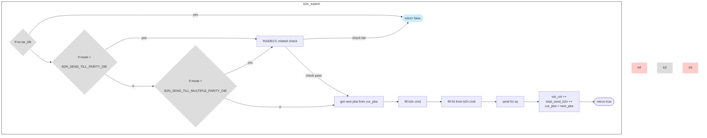

```mermaid
flowchart TD
subgraph b2n_submit
    direction LR
    c1{"If no tar_blk"} --yes--> c2([return false])
    c1 --> c3{"if mode =
    B2N_SEND_TILL_PARITY_DIE"}
    c3 --yes--> c4["RAIDECC related check"]
    c3 --no--> c5{"if mode =
    B2N_SEND_TILL_MULTIPLE_PARITY_DIE"}
    c5 --yes--> c4["RAIDECC related check"]
    c5 --no--> c6["get next pba from cur_pba"]
    c4 --"check fail"---> c2
    c4 --"check pass"--> c6
    c6 --> c7["fill b2n cmd"]
    c7 --> c8["fill fct from b2n cmd"]
    c8 --> c9["send fct sq"]
    c9 --> c10["ost_cnt ++
    total_send_b2n ++
    cur_pba = next_pba"]
    c10 --> c11(["retrun true"])
end

style b2n_submit fill:#FFFFFF,stroke:#000000
style c1 fill:#DDDDDD,stroke:#0000
style c2 fill:#CCEEFF,stroke:#0000
style c3 fill:#DDDDDD,stroke:#0000
style b4 fill:#FFCCCC,stroke:#0000
style c5 fill:#DDDDDD,stroke:#0000
style b3 fill:#DDDDDD,stroke:#0000
style b4 fill:#FFCCCC,stroke:#0000
style b5 fill:#FFCCCC,stroke:#0000
```